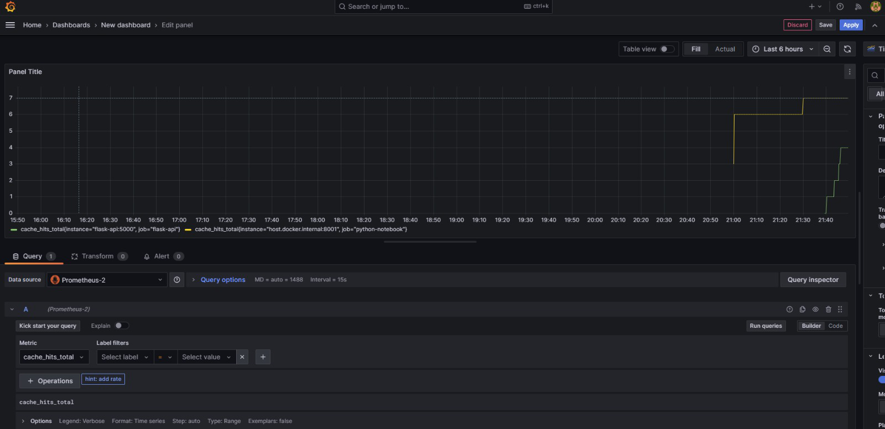

# 🎬 Netflix-Style Recommendation System Demo

## 🧠 System Architecture

<p align="center">
  
</p>

This project showcases a real-time, containerized recommendation pipeline using Docker Compose.  
It integrates services like Spark, Flask API, Redis, Prometheus, and Grafana to simulate a Netflix-style recommendation system.

---

## ✅ Step 1: Show the System is Running

**🎤 Narration:**  
“I’ve containerized and automated the entire Netflix-style recommendation pipeline using Docker Compose. Everything you see here is real-time and monitored.”

**🔧 Command:**
```bash
docker ps
```

**🔍 Expected Output:**
```bash
CONTAINER ID   IMAGE            COMMAND                  STATUS          PORTS
abc123         spark            "/bin/bash"              Up 5 minutes    ...
def456         jupyter          "start-notebook.sh"      Up 5 minutes    ...
ghi789         flask-api        "python app.py"          Up 5 minutes    5000/tcp
jkl012         redis            "docker-entrypoint.sh"   Up 5 minutes    6379/tcp
mno345         prometheus       "/bin/prometheus"        Up 5 minutes    9090/tcp
pqr678         grafana          "/run.sh"                Up 5 minutes    3000/tcp
```

🖼️ *Screenshot Placeholder: Insert a screenshot of the terminal displaying the `docker ps` output.*

---

## ✅ Step 2: Simulate a User Watching a Movie

**🎤 Narration:**  
“Let’s say user U999 watches C1010, which is, say, Stranger Things. The system automatically predicts and caches the next likely show.”

**🔧 Command:**
```bash
curl -X POST http://localhost:5000/watched \
  -H "Content-Type: application/json" \
  -d '{"user_id": "U999", "content_id": "C1010"}'
```

**🔍 Expected Response:**
```json
{
  "user_id": "U999",
  "watched": "C1010",
  "predicted_next": "C1045"
}
```

🖼️ *Screenshot Placeholder: Insert a screenshot of the terminal displaying the curl response.*

---

## ✅ Step 3: Retrieve Cached Recommendation

**🎤 Narration:**  
“Now, the user comes back to the app and asks: what should I watch next? We instantly return the prediction from Redis.”

**🔧 Command:**
```bash
curl http://localhost:5000/recommend/U999
```

**🔍 Expected Response:**
```json
{
  "user_id": "U999",
  "recommendation": "C1045",
  "cache_hit": true
}
```

🖼️ *Screenshot Placeholder: Insert a screenshot of the terminal displaying the curl response.*

---

## ✅ Step 4: Handle New User Scenario

**🎤 Narration:**  
“If the user is new and we don’t have predictions yet, the system handles it gracefully with a fallback.”

**🔧 Command:**
```bash
curl http://localhost:5000/recommend/U1234
```

**🔍 Expected Response:**
```json
{
  "user_id": "U1234",
  "recommendation": "C000",
  "cache_hit": false,
  "fallback_used": true
}
```

🖼️ *Screenshot Placeholder: Insert a screenshot of the terminal displaying the curl response.*

---

## ✅ Step 5: Monitor System Metrics with Prometheus

**🎤 Narration:**  
“We also expose Prometheus metrics for system health and activity.”

**🔧 Access:**  
Navigate to [http://localhost:9090](http://localhost:9090)

**🔍 Metrics to Observe:**
- `cache_hits`
- `cache_misses`
- `fallbacks_used`

🖼️ *Screenshot Placeholder: Insert a screenshot of the Prometheus dashboard displaying the relevant metrics.*

---

## ✅ Step 6: Visualize Data with Grafana

**🎤 Narration:**  
“Here’s the Grafana dashboard tracking live recommendations, cache efficiency, fallback trends, and more.”

**🔧 Access:**  
Navigate to [http://localhost:3000](http://localhost:3000)

**🔐 Login Credentials:**
- Username: `admin`
- Password: `admin`

<p align="center">
  
</p>*

---

## 🎁 Bonus Features

- Develop a simple HTML/JS frontend or CLI to simulate the watch and recommend flow.
- Display Spark job logs within JupyterLab or via Docker logs.
- Highlight the pipeline's extensibility for federated learning, edge caching, or A/B testing.
